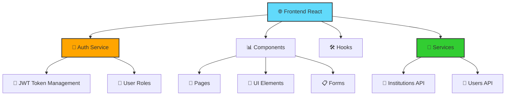
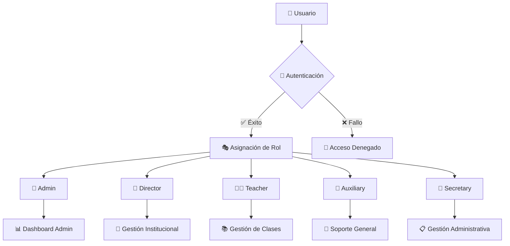
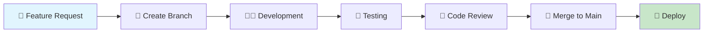

# 🎓 EduAssist - Web School Management System

<div align="center">
  
  
  
  
  
  
</div>

## 📋 Tabla de Contenidos

- [📖 Descripción del Proyecto](#-descripción-del-proyecto)
- [🏗️ Arquitectura del Proyecto](#️-arquitectura-del-proyecto)
- [📁 Estructura de Carpetas](#-estructura-de-carpetas)
- [🎨 Estándares de Código](#-estándares-de-código)
- [⚙️ Tecnologías y Dependencias](#️-tecnologías-y-dependencias)
- [🚀 Configuración e Instalación](#-configuración-e-instalación)
- [🔐 Autenticación y Autorización](#-autenticación-y-autorización)
- [📊 Patrones de Componentes](#-patrones-de-componentes)
- [🎯 Convenciones de Nomenclatura](#-convenciones-de-nomenclatura)
- [📝 Guía de Desarrollo](#-guía-de-desarrollo)
- [🧪 Testing](#-testing)
- [📦 Build y Deploy](#-build-y-deploy)

---

## 📖 Descripción del Proyecto

**EduAssist** es un sistema integral de gestión escolar desarrollado en React que permite la administración completa de instituciones educativas. El sistema maneja diferentes roles de usuario y proporciona funcionalidades específicas para cada tipo de usuario.

### 🎯 Objetivos del Sistema

- ✅ Gestión de usuarios por roles (Admin, Director, Profesor, Auxiliar, Secretario)
- ✅ Administración de instituciones educativas
- ✅ Dashboard interactivo y reportes
- ✅ Interfaz responsive y moderna
- ✅ Autenticación segura con JWT
- ✅ Sistema de permisos granular

---

## 🏗️ Arquitectura del Proyecto



### 🏛️ Patrón de Arquitectura

El proyecto sigue una **arquitectura basada en componentes** con las siguientes características:

- **🔄 Unidirectional Data Flow**: Los datos fluyen de padres a hijos
- **🎣 Custom Hooks**: Lógica reutilizable encapsulada
- **🔐 Authentication Layer**: Capa de autenticación centralizada
- **📡 Service Layer**: Servicios para comunicación con APIs
- **🎨 Component-Based UI**: Componentes reutilizables y modulares

---

## 📁 Estructura de Carpetas

```
vg-web-school/
├── 📄 package.json                    # Configuración del proyecto
├── 📄 README.md                       # Documentación principal
├── 📁 public/                         # Archivos públicos estáticos
│   ├── 🖼️ favicon.png
│   └── 📄 index.html
└── 📁 src/                           # Código fuente principal
    ├── 📄 App.js                      # Componente raíz (vacío)
    ├── 📄 appcontainer.jsx            # Contenedor principal de la app
    ├── 📄 approuter.jsx               # Configuración de rutas
    ├── 📄 index.js                    # Punto de entrada
    │
    ├── 📁 assets/                     # Recursos estáticos
    │   ├── 📁 css/                    # Hojas de estilo
    │   ├── 📁 fonts/                  # Fuentes tipográficas
    │   ├── 📁 img/                    # Imágenes y recursos visuales
    │   └── 📁 json/                   # Archivos JSON de datos
    │
    ├── 📁 auth/                       # Sistema de autenticación
    │   └── 📄 authService.js          # Servicios de autenticación JWT
    │
    ├── 📁 components/                 # Componentes reutilizables
    │   ├── 📄 AlertModal.jsx          # Modal de alertas
    │   ├── 📄 AuthDebug.jsx           # Debug de autenticación
    │   ├── 📄 Header.jsx              # Cabecera principal
    │   ├── 📄 Sidebar.jsx             # Barra lateral de navegación
    │   ├── 📄 ProtectedRoute.jsx      # Rutas protegidas por rol
    │   ├── 📄 Pagination.jsx          # Componente de paginación
    │   ├── 📁 Dashboard/              # Componentes del dashboard
    │   ├── 📁 Forms/                  # Componentes de formularios
    │   ├── 📁 Tables/                 # Componentes de tablas
    │   └── 📁 Ui_Elements/            # Elementos de UI reutilizables
    │
    ├── 📁 hooks/                      # Custom React Hooks
    │   ├── 📄 useAuth.js              # Hook de autenticación
    │   ├── 📄 useAlert.js             # Hook de alertas
    │   └── 📄 useTitle.js             # Hook para título de página
    │
    ├── 📁 pages/                      # Páginas principales por rol
    │   ├── 📁 admin/                  # Páginas del administrador
    │   ├── 📁 director/               # Páginas del director
    │   ├── 📁 teacher/                # Páginas del profesor
    │   ├── 📁 auxiliary/              # Páginas del auxiliar
    │   └── 📁 secretary/              # Páginas del secretario
    │
    ├── 📁 services/                   # Servicios de API
    │   ├── 📁 institutions/           # Servicios de instituciones
    │   └── 📁 users/                  # Servicios de usuarios
    │
    ├── 📁 types/                      # Definiciones de tipos
    │   ├── 📁 institutions/           # Tipos de instituciones
    │   └── 📁 users/                  # Tipos de usuarios
    │
    └── 📁 utils/                      # Utilidades y helpers
        └── 📁 institutions/           # Utilidades específicas
```

### 📂 Descripción de Directorios

| Directorio | Propósito | Convenciones |
|------------|-----------|--------------|
| `📁 components/` | Componentes UI reutilizables | PascalCase, extensión `.jsx` |
| `📁 pages/` | Páginas principales organizadas por rol | Carpetas por rol, componentes en PascalCase |
| `📁 hooks/` | Custom hooks de React | Prefijo `use`, camelCase |
| `📁 services/` | Lógica de comunicación con APIs | camelCase, funciones async/await |
| `📁 auth/` | Sistema de autenticación centralizado | Servicios JWT, manejo de tokens |
| `📁 assets/` | Recursos estáticos (CSS, imágenes, fuentes) | Organizado por tipo de recurso |

---

## 🎨 Estándares de Código

### 📝 Formato de Código

```javascript
// ✅ CORRECTO: Componente funcional con destructuring
const UserProfile = ({ user, onEdit, onDelete }) => {git 
  const { isAuthenticated, logout } = useAuth();
  
  const handleEdit = useCallback(() => {
    onEdit(user.id);
  }, [user.id, onEdit]);

  return (
    <div className="user-profile">
      <h2>{user.name}</h2>
      <span className="user-role">{user.primaryRole}</span>
    </div>
  );
};

// ❌ INCORRECTO: Clase component (usar solo funcionales)
class UserProfile extends Component {
  render() {
    return <div>...</div>;
  }
}
```

### 🏷️ ESLint Configuration

```javascript
// .eslintrc.js
module.exports = {
  extends: ['react-app'],
  rules: {
    'no-unused-vars': 'warn',
    'react/jsx-no-undef': 'error',
    'jsx-quotes': ['error', 'prefer-double'],
    'quotes': ['error', 'single'],
    'semi': ['error', 'always']
  }
};
```

### 🎯 Reglas de Código

| Regla | Descripción | Ejemplo |
|-------|-------------|---------|
| **Componentes Funcionales** | Usar solo componentes funcionales | `const MyComponent = () => {...}` |
| **Hooks** | Usar hooks para estado y efectos | `useState`, `useEffect`, `useCallback` |
| **Props Destructuring** | Destructurar props en parámetros | `({ user, onEdit }) => {...}` |
| **Naming Convention** | PascalCase para componentes | `UserProfile.jsx` |
| **File Extensions** | `.jsx` para componentes React | `Header.jsx`, `Sidebar.jsx` |

---

## ⚙️ Tecnologías y Dependencias

### 🎯 Core Dependencies

| Tecnología | Versión | Propósito |
|------------|---------|-----------|
| **React** | `19.0.0` | 🎨 Framework principal de UI |
| **React Router DOM** | `7.2.0` | 🛤️ Enrutamiento de la aplicación |
| **Bootstrap** | `5.3.3` | 🎨 Framework CSS para estilos |
| **Axios** | `1.9.0` | 📡 Cliente HTTP para APIs |

### 📊 UI & Visualization

| Librería | Versión | Uso |
|----------|---------|-----|
| **Ant Design** | `5.24.2` | 🎨 Componentes UI avanzados |
| **React Bootstrap** | `2.10.9` | 🧩 Componentes Bootstrap para React |
| **Chart.js** | `4.5.0` | 📊 Gráficos y visualizaciones |
| **ApexCharts** | `4.5.0` | 📈 Gráficos interactivos |
| **FullCalendar** | `6.1.15` | 📅 Calendario interactivo |

### 🛠️ Development Tools

```json
{
  "devDependencies": {
    "eslint": "^8.53.0",
    "@babel/plugin-proposal-private-property-in-object": "^7.21.11"
  },
  "scripts": {
    "start": "react-scripts start",
    "build": "react-scripts build", 
    "test": "react-scripts test",
    "lint": "eslint .",
    "lint:fix": "eslint --fix ."
  }
}
```

---

## 🚀 Configuración e Instalación

### 📋 Prerrequisitos

- **Node.js**: `>= 18.0.0` 
- **npm**: `>= 8.0.0`
- **Git**: Para control de versiones

### 🔧 Instalación

```bash
# 1. Clonar el repositorio
git clone <repository-url>
cd vg-web-school

# 2. Instalar dependencias
npm install

# 3. Configurar variables de entorno
cp .env.example .env
# Editar .env con tus configuraciones

# 4. Iniciar servidor de desarrollo
npm start

# 5. Abrir en el navegador
# http://localhost:3000/school
```

### 🌍 Variables de Entorno

```bash
# .env
REACT_APP_DOMAIN=https://your-api-domain.com
REACT_APP_VERSION=1.0.0
REACT_APP_ENVIRONMENT=development
```

### 📦 Scripts Disponibles

| Script | Comando | Descripción |
|--------|---------|-------------|
| **Desarrollo** | `npm start` | 🚀 Inicia servidor de desarrollo |
| **Build** | `npm run build` | 📦 Genera build de producción |
| **Testing** | `npm test` | 🧪 Ejecuta tests |
| **Linting** | `npm run lint` | 🔍 Analiza código con ESLint |
| **Fix Lint** | `npm run lint:fix` | 🔧 Corrige errores de linting |

---

## 🔐 Autenticación y Autorización

### 🏛️ Sistema de Roles



### 🔑 Implementación de Autenticación

```javascript
// authService.js - Estructura del servicio
export const authService = {
  // 🔐 Autenticación
  loginKeycloak: async (username, password) => { /* JWT Login */ },
  
  // 🔄 Renovación de tokens
  refreshTokenKeycloak: async (refreshToken) => { /* Token refresh */ },
  
  // 👤 Información del usuario
  getUserInfo: () => { /* Decodifica JWT y extrae info */ },
  
  // 🎭 Verificación de roles
  hasRole: (role) => { /* Verifica rol específico */ },
  isAdmin: () => { /* Verifica si es admin */ },
  isTeacher: () => { /* Verifica si es profesor */ }
};
```

### 🛡️ Rutas Protegidas

```javascript
// ProtectedRoute.jsx - Implementación
const ProtectedRoute = ({ children, requiredRoles = [] }) => {
  const { isAuthenticated, user } = useAuth();
  
  if (!isAuthenticated) {
    return <Navigate to="/login" replace />;
  }
  
  if (requiredRoles.length > 0 && !canAccessRoute(requiredRoles)) {
    return <Navigate to="/unauthorized" replace />;
  }
  
  return children;
};

// Uso en rutas
<ProtectedRoute requiredRoles={['admin', 'director']}>
  <AdminDashboard />
</ProtectedRoute>
```

### 👥 Roles del Sistema

| Rol | Permisos | Accesos |
|-----|----------|---------|
| **👑 Admin** | Administración completa del sistema | Todos los módulos |
| **🏢 Director** | Gestión de su institución | Dashboard, Reportes, Usuarios |
| **👨‍🏫 Teacher** | Gestión de clases y estudiantes | Clases, Calificaciones, Reportes |
| **👥 Auxiliary** | Soporte y asistencia | Módulos específicos asignados |
| **📝 Secretary** | Administración y documentos | Gestión administrativa |

---

## 📊 Patrones de Componentes

### 🧩 Estructura de Componente Base

```javascript
// ComponentTemplate.jsx
import React, { useState, useEffect, useCallback } from 'react';
import PropTypes from 'prop-types';
import useAuth from '../hooks/useAuth';

/**
 * 📋 Descripción del componente
 * @param {Object} props - Propiedades del componente
 * @param {string} props.title - Título del componente
 * @param {Function} props.onAction - Callback para acciones
 */
const ComponentTemplate = ({ title, onAction, children }) => {
  // 🎣 Hooks del estado local
  const [loading, setLoading] = useState(false);
  const [data, setData] = useState(null);
  
  // 🎣 Hooks personalizados
  const { user, isAuthenticated } = useAuth();
  
  // 📝 Handlers de eventos
  const handleAction = useCallback(() => {
    setLoading(true);
    onAction?.();
    setLoading(false);
  }, [onAction]);
  
  // 🔄 Efectos
  useEffect(() => {
    // Lógica de inicialización
  }, []);
  
  // 📋 Renderizado condicional
  if (!isAuthenticated) {
    return <div>Acceso no autorizado</div>;
  }
  
  return (
    <div className="component-container">
      <header className="component-header">
        <h2>{title}</h2>
      </header>
      <main className="component-body">
        {children}
      </main>
      <footer className="component-footer">
        <button onClick={handleAction} disabled={loading}>
          {loading ? 'Cargando...' : 'Acción'}
        </button>
      </footer>
    </div>
  );
};

// 🏷️ PropTypes para validación
ComponentTemplate.propTypes = {
  title: PropTypes.string.isRequired,
  onAction: PropTypes.func,
  children: PropTypes.node
};

// 🎯 Valores por defecto
ComponentTemplate.defaultProps = {
  onAction: null,
  children: null
};

export default ComponentTemplate;
```

### 🎣 Custom Hooks Pattern

```javascript
// useAuth.js - Hook personalizado
const useAuth = () => {
  const [user, setUser] = useState(null);
  const [isAuthenticated, setIsAuthenticated] = useState(false);
  const [loading, setLoading] = useState(true);
  
  const checkAuth = useCallback(async () => {
    // Lógica de verificación de autenticación
  }, []);
  
  const logout = () => {
    // Lógica de logout
  };
  
  return {
    user,
    isAuthenticated, 
    loading,
    logout,
    checkAuth
  };
};
```

### 📋 Patrones de Formularios

```javascript
// FormPattern.jsx
const FormPattern = ({ onSubmit, initialData = {} }) => {
  const [formData, setFormData] = useState(initialData);
  const [errors, setErrors] = useState({});
  const [isSubmitting, setIsSubmitting] = useState(false);
  
  const handleChange = (field) => (event) => {
    const value = event.target.value;
    setFormData(prev => ({
      ...prev,
      [field]: value
    }));
    
    // Limpiar error al escribir
    if (errors[field]) {
      setErrors(prev => ({
        ...prev,
        [field]: null
      }));
    }
  };
  
  const validate = () => {
    const newErrors = {};
    
    if (!formData.name?.trim()) {
      newErrors.name = 'El nombre es requerido';
    }
    
    return newErrors;
  };
  
  const handleSubmit = async (event) => {
    event.preventDefault();
    
    const validationErrors = validate();
    if (Object.keys(validationErrors).length > 0) {
      setErrors(validationErrors);
      return;
    }
    
    setIsSubmitting(true);
    try {
      await onSubmit(formData);
    } catch (error) {
      setErrors({ submit: error.message });
    } finally {
      setIsSubmitting(false);
    }
  };
  
  return (
    <form onSubmit={handleSubmit} className="form-pattern">
      <div className="form-group">
        <label htmlFor="name">Nombre</label>
        <input
          id="name"
          type="text"
          value={formData.name || ''}
          onChange={handleChange('name')}
          className={`form-control ${errors.name ? 'is-invalid' : ''}`}
        />
        {errors.name && <div className="invalid-feedback">{errors.name}</div>}
      </div>
      
      <button type="submit" disabled={isSubmitting}>
        {isSubmitting ? 'Guardando...' : 'Guardar'}
      </button>
    </form>
  );
};
```

---

## 🎯 Convenciones de Nomenclatura

### 📁 Archivos y Carpetas

| Tipo | Convención | Ejemplo | Descripción |
|------|------------|---------|-------------|
| **Componentes** | PascalCase + .jsx | `UserProfile.jsx` | Componentes React |
| **Hooks** | camelCase + use prefix | `useAuth.js` | Custom hooks |
| **Servicios** | camelCase + Service suffix | `authService.js` | Servicios de API |
| **Utilidades** | camelCase | `formatDate.js` | Funciones utilitarias |
| **Constantes** | UPPER_SNAKE_CASE | `API_ENDPOINTS.js` | Constantes globales |
| **Carpetas** | kebab-case | `user-management/` | Directorios |

### 🏷️ Variables y Funciones

```javascript
// ✅ CORRECTO: Naming conventions
const UserManagement = () => {
  const [userList, setUserList] = useState([]);
  const [isLoading, setIsLoading] = useState(false);
  const [selectedUser, setSelectedUser] = useState(null);
  
  const handleUserSelect = useCallback((userId) => {
    // Lógica de selección
  }, []);
  
  const handleUserDelete = async (userId) => {
    // Lógica de eliminación
  };
  
  return (
    <div className="user-management">
      {/* JSX */}
    </div>
  );
};

// ❌ INCORRECTO: Malas convenciones
const usermanagement = () => {
  const [list, setlist] = useState([]);
  const [loading, setloading] = useState(false);
  
  const click = (id) => {
    // Mal nombre de función
  };
};
```

### 🎨 CSS y Clases

```css
/* ✅ CORRECTO: BEM Methodology */
.user-profile {
  padding: 1rem;
}

.user-profile__header {
  margin-bottom: 1rem;
}

.user-profile__name {
  font-size: 1.5rem;
  font-weight: bold;
}

.user-profile__role {
  color: #666;
}

.user-profile--loading {
  opacity: 0.5;
}

/* ❌ INCORRECTO: Clases genéricas */
.header { }
.name { }
.text { }
```

### 🏷️ Constantes y Configuración

```javascript
// constants.js
export const API_ENDPOINTS = {
  AUTH: {
    LOGIN: '/api/v1/auth/login',
    REFRESH: '/api/v1/auth/refresh',
    LOGOUT: '/api/v1/auth/logout'
  },
  USERS: {
    LIST: '/api/v1/users',
    CREATE: '/api/v1/users',
    UPDATE: (id) => `/api/v1/users/${id}`,
    DELETE: (id) => `/api/v1/users/${id}`
  }
};

export const USER_ROLES = {
  ADMIN: 'admin',
  DIRECTOR: 'director', 
  TEACHER: 'teacher',
  AUXILIARY: 'auxiliary',
  SECRETARY: 'secretary'
};

export const MESSAGES = {
  SUCCESS: {
    USER_CREATED: 'Usuario creado exitosamente',
    USER_UPDATED: 'Usuario actualizado exitosamente'
  },
  ERROR: {
    NETWORK_ERROR: 'Error de conexión',
    UNAUTHORIZED: 'No tienes permisos para esta acción'
  }
};
```

---

## 📝 Guía de Desarrollo

### 🔄 Workflow de Desarrollo



### 🌿 Git Branching Strategy

```bash
# Estructura de branches
main                    # 🏠 Rama principal (producción)
├── develop            # 🔄 Rama de desarrollo
├── feature/user-auth  # ✨ Nueva funcionalidad
├── hotfix/login-bug   # 🐛 Corrección urgente
└── release/v1.2.0     # 📦 Preparación de release
```

### 📋 Commit Messages

```bash
# ✅ CORRECTO: Conventional Commits
feat(auth): add JWT token refresh functionality
fix(header): resolve user dropdown not showing
docs(readme): update installation instructions
style(sidebar): improve responsive design
refactor(hooks): optimize useAuth performance
test(auth): add unit tests for login service

# ❌ INCORRECTO: Mensajes poco descriptivos
fix bug
update stuff
changes
```

### 🧪 Testing Guidelines

```javascript
// UserProfile.test.jsx
import React from 'react';
import { render, screen, fireEvent } from '@testing-library/react';
import { BrowserRouter } from 'react-router-dom';
import UserProfile from './UserProfile';

const renderWithRouter = (component) => {
  return render(
    <BrowserRouter>
      {component}
    </BrowserRouter>
  );
};

describe('UserProfile Component', () => {
  const mockUser = {
    id: 1,
    name: 'John Doe',
    primaryRole: 'admin'
  };
  
  test('renders user information correctly', () => {
    renderWithRouter(<UserProfile user={mockUser} />);
    
    expect(screen.getByText('John Doe')).toBeInTheDocument();
    expect(screen.getByText('admin')).toBeInTheDocument();
  });
  
  test('calls onEdit when edit button is clicked', () => {
    const mockOnEdit = jest.fn();
    
    renderWithRouter(
      <UserProfile user={mockUser} onEdit={mockOnEdit} />
    );
    
    const editButton = screen.getByRole('button', { name: /edit/i });
    fireEvent.click(editButton);
    
    expect(mockOnEdit).toHaveBeenCalledWith(mockUser.id);
  });
});
```

### 📊 Performance Guidelines

```javascript
// ✅ CORRECTO: Optimización de rendimiento
const UserList = React.memo(({ users, onUserSelect }) => {
  const memoizedUsers = useMemo(() => {
    return users.filter(user => user.active);
  }, [users]);
  
  const handleSelect = useCallback((userId) => {
    onUserSelect(userId);
  }, [onUserSelect]);
  
  return (
    <div>
      {memoizedUsers.map(user => (
        <UserCard 
          key={user.id} 
          user={user} 
          onSelect={handleSelect} 
        />
      ))}
    </div>
  );
});

// ❌ INCORRECTO: Sin optimización
const UserList = ({ users, onUserSelect }) => {
  return (
    <div>
      {users.filter(user => user.active).map(user => (
        <UserCard 
          key={user.id} 
          user={user} 
          onSelect={(userId) => onUserSelect(userId)} 
        />
      ))}
    </div>
  );
};
```

---

## 🧪 Testing

### 🏗️ Estructura de Testing

```
src/
├── __tests__/                 # Tests globales
│   ├── App.test.js
│   └── setupTests.js
├── components/
│   ├── Header.jsx
│   ├── Header.test.jsx        # Test del componente
│   └── __tests__/             # Tests específicos del directorio
└── hooks/
    ├── useAuth.js
    └── useAuth.test.js        # Test del hook
```

### 🧪 Tipos de Tests

| Tipo | Herramienta | Propósito | Ejemplo |
|------|-------------|-----------|---------|
| **Unit Tests** | Jest + RTL | Componentes individuales | `UserProfile.test.jsx` |
| **Integration Tests** | Jest + RTL | Interacción entre componentes | `LoginFlow.test.jsx` |
| **Hook Tests** | Jest + RTL Hooks | Custom hooks | `useAuth.test.js` |

### 🛠️ Configuración de Testing

```javascript
// setupTests.js
import '@testing-library/jest-dom';

// Mock de localStorage
const localStorageMock = {
  getItem: jest.fn(),
  setItem: jest.fn(),
  removeItem: jest.fn(),
  clear: jest.fn(),
};
global.localStorage = localStorageMock;

// Mock de console.error para tests limpios
const originalError = console.error;
beforeAll(() => {
  console.error = (...args) => {
    if (typeof args[0] === 'string' && args[0].includes('Warning:')) {
      return;
    }
    originalError.call(console, ...args);
  };
});

afterAll(() => {
  console.error = originalError;
});
```

### 📋 Test Commands

```bash
# Ejecutar todos los tests
npm test

# Ejecutar tests en modo watch
npm test -- --watch

# Ejecutar tests con coverage
npm test -- --coverage

# Ejecutar tests específicos
npm test -- UserProfile.test.jsx
```

---

## 📦 Build y Deploy

### 🏗️ Proceso de Build

```bash
# Build de producción
npm run build

# Estructura de build
build/
├── static/
│   ├── css/          # Archivos CSS minificados
│   ├── js/           # Archivos JavaScript minificados
│   └── media/        # Recursos de medios
├── index.html        # HTML principal
└── manifest.json     # Manifest de la aplicación
```

### 🌍 Variables de Entorno por Ambiente

```bash
# .env.development
REACT_APP_DOMAIN=http://localhost:8080
REACT_APP_ENVIRONMENT=development
REACT_APP_DEBUG=true

# .env.production
REACT_APP_DOMAIN=https://api.eduassist.com
REACT_APP_ENVIRONMENT=production
REACT_APP_DEBUG=false

# .env.staging
REACT_APP_DOMAIN=https://staging-api.eduassist.com
REACT_APP_ENVIRONMENT=staging
REACT_APP_DEBUG=true
```

### 🚀 Deploy Configuration

```javascript
// package.json - Deploy scripts
{
  "scripts": {
    "build:dev": "REACT_APP_ENV=development npm run build",
    "build:staging": "REACT_APP_ENV=staging npm run build", 
    "build:prod": "REACT_APP_ENV=production npm run build",
    "deploy:staging": "npm run build:staging && aws s3 sync build/ s3://staging-bucket",
    "deploy:prod": "npm run build:prod && aws s3 sync build/ s3://prod-bucket"
  }
}
```

### 📊 Métricas y Monitoring

```javascript
// Performance monitoring
import { getCLS, getFID, getFCP, getLCP, getTTFB } from 'web-vitals';

function sendToAnalytics(metric) {
  // Enviar métricas a servicio de analytics
  console.log(metric);
}

getCLS(sendToAnalytics);
getFID(sendToAnalytics);
getFCP(sendToAnalytics);
getLCP(sendToAnalytics);
getTTFB(sendToAnalytics);
```

---

## 📚 Recursos Adicionales

### 📖 Documentación de Referencias

- [📘 React Documentation](https://react.dev/)
- [🛤️ React Router](https://reactrouter.com/)
- [🎨 Bootstrap Documentation](https://getbootstrap.com/)
- [📊 Chart.js](https://www.chartjs.org/)
- [🧪 Testing Library](https://testing-library.com/)

### 🛠️ Herramientas de Desarrollo

- **VS Code Extensions**:
  - ES7+ React/Redux/React-Native snippets
  - Prettier - Code formatter
  - ESLint
  - Auto Rename Tag
  - Bracket Pair Colorizer

- **Chrome Extensions**:
  - React Developer Tools
  - Redux DevTools

### 🤝 Contribución

1. **Fork** del proyecto
2. **Crear** branch para feature (`git checkout -b feature/AmazingFeature`)
3. **Commit** cambios (`git commit -m 'feat: Add some AmazingFeature'`)
4. **Push** al branch (`git push origin feature/AmazingFeature`)
5. **Abrir** Pull Request

---

## 📞 Contacto y Soporte

### 👥 Equipo de Desarrollo

- **Project Lead**: [Nombre del líder]
- **Frontend Team**: [Equipo frontend]
- **Backend Team**: [Equipo backend]

### 🐛 Reportar Issues

Para reportar bugs o solicitar features:

1. 🔍 Verificar que no exista un issue similar
2. 📝 Usar el template de issue correspondiente
3. 🏷️ Agregar labels apropiadas
4. 📋 Proporcionar información detallada

---

<div align="center">

## 📄 Licencia

Este proyecto es privado y confidencial. Todos los derechos reservados.

---

**🎓 EduAssist** - Sistema de Gestión Escolar  
Desarrollado con ❤️ usando React y tecnologías modernas


</div>